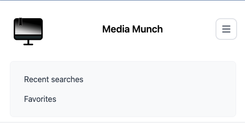
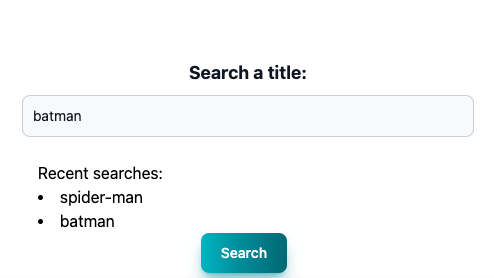
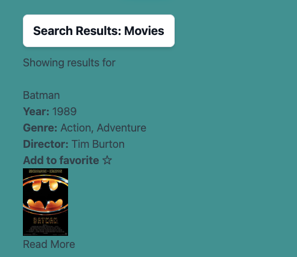
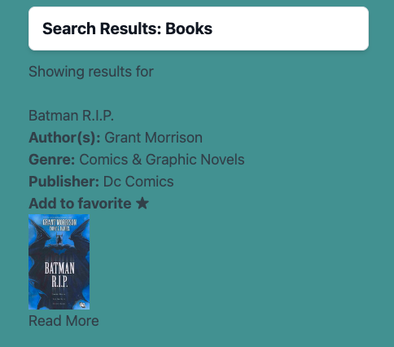

# Project : Media Munch
https://overtonr.github.io/project1-media-munch/
## Description:
Media Munch is a personal media watch/read list. Users have the ability to search a title and will get results for movies and books. Along with the title, they will also get information about the authors and directors, the year it was released, and the genre of the media. Users can see their recent searches, and also have the ability to add items to a favorite list. 

## Usage: 
The top of the screen contains a navigation bar. This includes internal links that allows users to jump to that portion of the page when the item is clicked.

Users are presented with a form with the ability to search movies and books by title. Once the form is submitted, their input is appended to a recent searches list. This allows users to click on an item previously searched, and it repopulates the data by retrieving the data from the local storage. 

The data is fetched by using the user's input to make an API call. We sorted through the data to append to desired data to a results card. 
```
function searchOMDB(movie) {
    var omdbAPI = "https://www.omdbapi.com/?apikey=58823a0&t=" + movie;
    fetch(omdbAPI)
        .then(function (response) {
            return response.json()
        })
        .then(function (data) {
                resultContentEl.textContent = '';
                movieResults(data);
            }
        )};
```
The data is then dynamically appended using JavaScript. Each result is appended as an individual item containing a summary of the important information about that title. 
```
var titleEl = document.createElement('h3');
    titleEl.textContent = resultObj.Title;
```

Users also have the ability to add an item to their favorites bar by selecting the star. Once the favorite button is clicked, the star is filled in and it is appended to their favorites list.


## Technologies Used:
* Github
* HTML
* CSS
* Flowbite
* Tailwind
* JavaScript
* VS Code
* OMDB API
* GoogleBooks API

## Authors
- Kendrick Brown
- Gregory Krolick
- Rebecca Overton
- Jie Zou


## License 
Please refer to the license in the repository.
